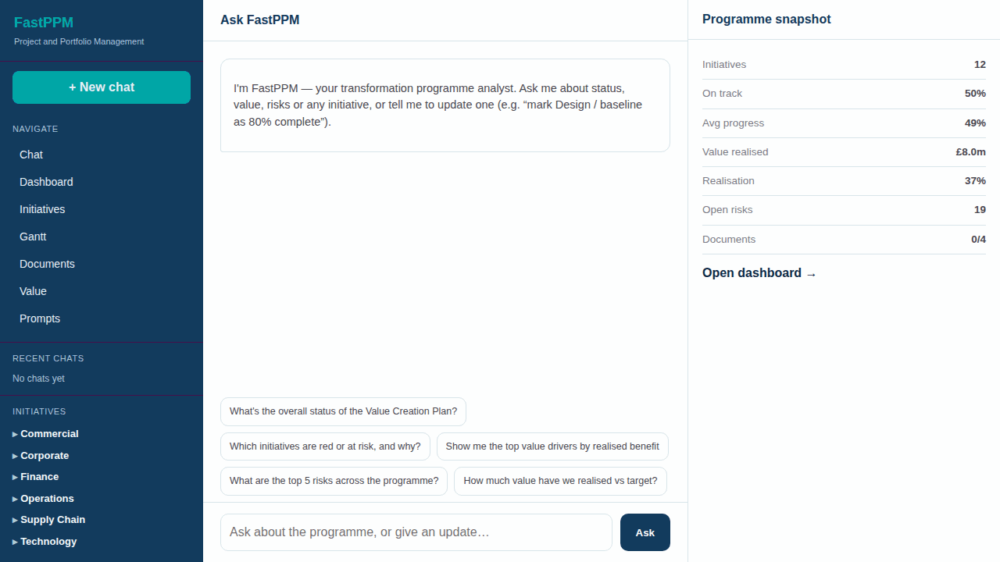

# FastPPM — Project and Portfolio Management

A conversational-first project-management and use-case-tracking tool for a single
PE portfolio company's **Transformation Office**. FastPPM ingests messy,
siloed documents (PDF status reports, Excel trackers, PowerPoint decks, Word
charters), normalises them to a canonical schema, and delivers a unified master
repository with a Gantt, value tracking, dashboards and a **chat-first analyst**
as the primary interaction layer.

## Product tour



Key screens are also documented in the [Markdown user guide](docs/fastppm_user_guide.md)
and the generated PDF and PowerPoint guides under `docs/`.

FastPPM uses a FastHTML 3-pane UI, a pluggable storage facade, xAI Grok via
LangChain, and Plotly dashboards.
Deploys at **fastppm.predictivelabs.ai**.

> Build plan & earlier decisions: [`docs/PLAN.md`](docs/PLAN.md).

## What it does

- **Document ingestion (flagship)** — drag-drop PDF/XLSX/PPTX/DOCX; the engine
  extracts milestones, risks and value drivers, normalises varying column names /
  date formats to a canonical schema, flags inconsistencies, and presents an
  **extracted N milestones · M risks · K inconsistencies** review screen. One
  click **merges** them into the master repository as initiatives.
- **Chat analyst (centre of the app)** — "Ask FastPPM" answers status, value,
  risk and document questions over the unified data, and applies **natural-language
  updates** ("mark Design / baseline as 80% complete", "set ERP modernisation to
  at risk") with an audit trail.
- **Master Gantt** — baseline vs. plan bars, milestone markers coloured by status,
  a today line; plus a Kanban and dependency mapping.
- **Programme dashboard** — value realised vs. target, RAG health, on-time
  delivery, value waterfall and by-category breakdown.
- **Initiative / use-case detail** — milestones, risks, value, linked source
  document and a full audit trail.
- **Value tracking** — planned vs. realised by quarter and category.

## Architecture

```
storage/base.py          Storage interface (canonical model, backend-neutral)
storage/sqlite_store.py    └─ SQLite / Postgres backend (SQLAlchemy core)
ppmstore.py              facade → active backend  (import ppmstore as store)
ingest/extract.py        per-format extraction (pdfplumber/openpyxl/pptx/docx)
ingest/normalize.py      → canonical entities (Grok LLM, or heuristic fallback)
ingest/service.py        process_document() + merge_document()
agents/orchestrator.py   chat analyst (LangGraph + SSE)
agents/tools.py          programme / initiative / risk / value / document / update
rag/llm.py               Grok client (xAI, OpenAI-compatible)
web/app.py               FastHTML app + routes + upload/merge handlers
web/ui.py                design system + 3-pane shell
web/{dashboard,initiatives,gantt,documents}.py   pages
config/programme.yaml    demo programme (workstreams + AI use cases)
scripts/seed.py          load the programme + generate the sample documents
scripts/gen_samples.py   messy PDF/XLSX/PPTX/DOCX sources for the ingestion demo
tests/test_storage.py    storage contract test
```

Canonical model: `initiatives` (programme → workstreams / AI use cases) with
`milestones` (+dependencies), `risks`, `value_entries`, ingested `documents`
(extracted → merged) and an `activity_log` audit trail. Everything goes through
the `Storage` interface, selected by `DATA_STORAGE` (`sqlite`, also Postgres via
`DB_URL`).

The ingestion engine degrades gracefully: with `XAI_API_KEY` set, Grok normalises
each document; without it, a header-aware heuristic parser does. The chat analyst
degrades the same way.

## Quickstart

```bash
python3.12 -m venv .venv && . .venv/bin/activate
pip install -r requirements.txt
cp .env.example .env            # set ADMIN_PASSWORD, APP_SECRET, (optional) XAI_API_KEY

python -m scripts.seed          # load the demo programme + sample documents
python -m uvicorn web.app:app --port 5012
# open http://localhost:5012  (sign in with ADMIN_EMAIL / ADMIN_PASSWORD)
```

Run the tests:

```bash
pytest -q
```

## Try the flagship flow

1. Open **Documents** → drag in a file from `samples/` (or your own status
   report / tracker / deck).
2. Click **Upload & extract** → the engine parses and normalises it.
3. **Review** the extracted milestones, risks, value drivers and inconsistencies.
4. **Merge into master repository** → it appears as an initiative in the registry,
   Gantt and dashboard, and becomes searchable from the chat.

Or just ask the chat: *"which initiatives are red?"*, *"how much value have we
realised?"*, *"mark Design / baseline as 80% complete"*.

## Deploy

Docker / Coolify, port **5012**, persistent volume at `/app/data` (SQLite db +
uploaded documents). The post-deploy command runs `python -m scripts.seed`.

```bash
docker compose up -d web
```

For Postgres in production, set `DB_URL=postgresql+psycopg2://…` — no code change.

## User roles

`transformation_lead` / `executive` (read + approvals) · `pmo` (full CRUD) ·
`functional_owner` (status updates). Seeded admin user has the `admin` role.
