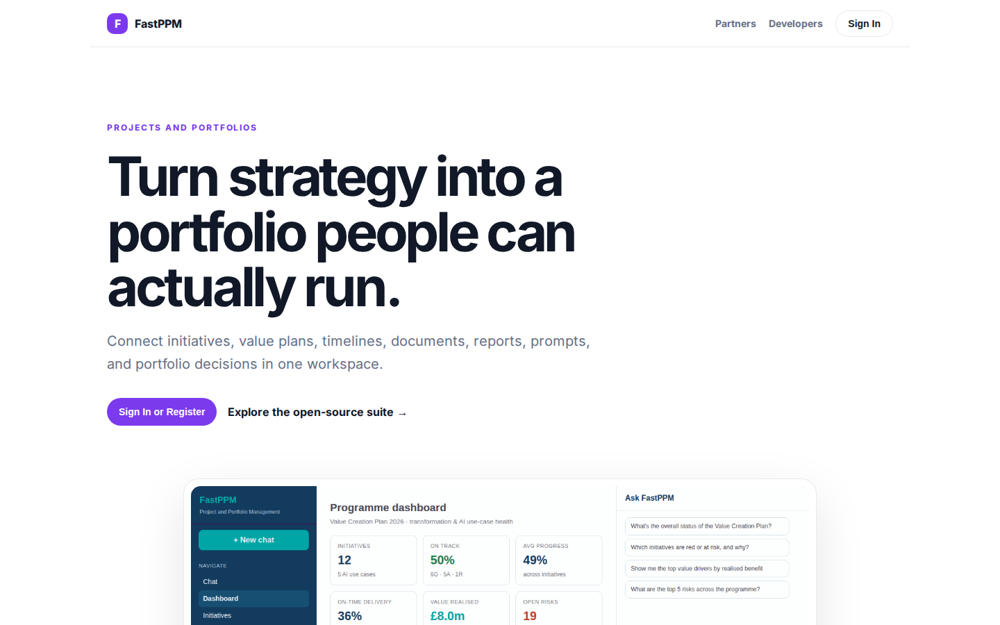
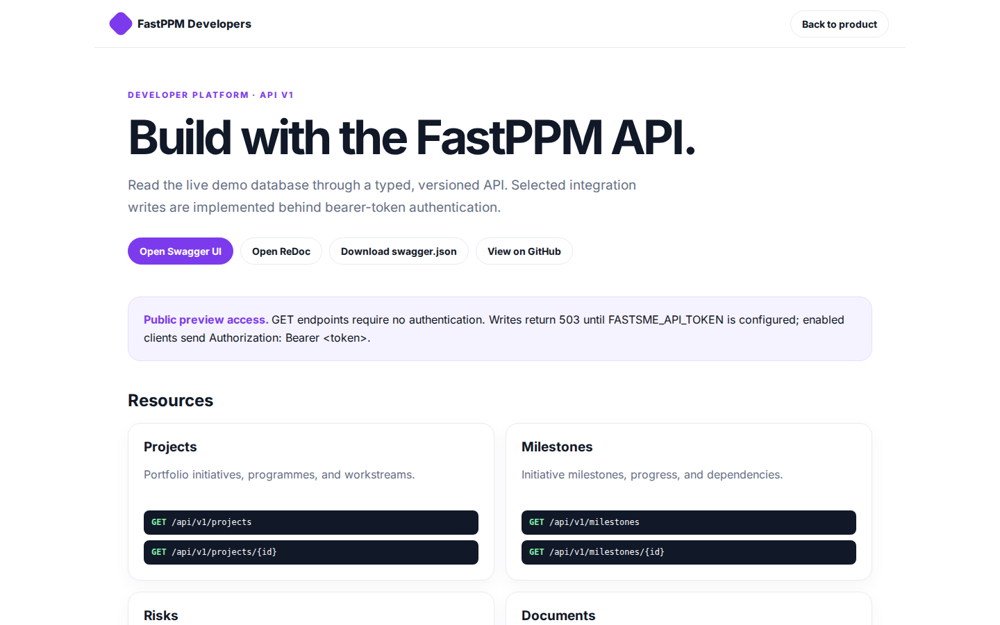

# FastPPM Platform Guide

**Published:** 2026-08-19
**Platform:** [https://ppm.fastsme.com](https://ppm.fastsme.com)
**Source:** [github.com/predictivelabsai/FastPPM](https://github.com/predictivelabsai/FastPPM)

## Platform overview

A conversational-first project-management and use-case-tracking tool for a single PE portfolio company's **Transformation Office**. FastPPM ingests messy, siloed documents (PDF status reports, Excel trackers, PowerPoint decks, Word charters), normalises them to a canonical schema, and delivers a unified master reposito

This visual guide was reviewed against the live product using Playwright. Screens and available navigation can vary by account, role, and deployment configuration.

## 1. Turn strategy into a portfolio people can actually run.

PROJECTS AND PORTFOLIOS Turn strategy into a portfolio people can actually run. Connect initiatives, value plans, timelines, documents, reports, prompts, and portfolio decisions in one workspace. Sign In or Register Explore the open-source suite → Product tour

Screen reviewed at: [https://ppm.fastsme.com/](https://ppm.fastsme.com/)

## 2. Build with the FastPPM API.

FastPPM Developers Back to product DEVELOPER PLATFORM · API V1 Build with the FastPPM API. Read the live demo database through a typed, versioned API. Selected integration writes are implemented behind bearer-token authentication. Open Swagger UI Open ReDoc Do

Screen reviewed at: [https://ppm.fastsme.com/developers](https://ppm.fastsme.com/developers)

## 3. Sign in

Sign in with Google Sign in to continue to fastsme.com Email or phone Forgot email? Next Create account Afrikaans azərbaycan bosanski català Čeština Cymraeg Dansk Deutsch eesti English (United Kingdom) English (United States) Español (España) Español (Latinoam

Screen reviewed at: [https://accounts.google.com/v3/signin/identifier?opparams=%253F&dsh=S-650794498%3A1787122829828716&access_type=online&client_id=887059023987-2a7spj1m82eivobdbt1itb3cqca6tpt1.apps.googleusercontent.com&o2v=2&prompt=select_account&redirect_uri=https%3A%2F%2Fppm.fastsme.com%2Fauth%2Fcallback&response_type=code&scope=openid+email+profile&service=lso&state=awPUeuM2fyEP6zB73icpqUDPznE_s8XA&flowName=GeneralOAuthLite&continue=https%3A%2F%2Faccounts.google.com%2Fsignin%2Foauth%2Flegacy%2Fconsent%3Fauthuser%3Dunknown%26part%3DAJi8hAMefWK8WifqhZxK0f_CcV6Go89fOSRPVuhC6f6xEengJY3nIRKg69YP6H0ELszo2blhnbxYQxaMsn_dQifpGVWWKEBb777XfAF01wLkFiP4-mbIE5wR0ZiS4YR20Z4ViwpJvPTtJlLYgdyWVq3SNtJh4oHv5HB7KX5WchsMu4V-sRIrvr1L2CzUMXuitAO-Oj04ojsclGBz3DZ_6rWTooNeFZxBz_xbiYtU7VLXx-HcOAAxrSTTzO57kqUFEVaIXfk85HBIZzKlBaWZ2pWeRAxjJ9en7Fq5nDP1NMCnoXFLEbjQ_lZUYtJBwT49lFp44HRGNpuIO-cpcS5baf61fgc1qhyLI0Zi-g92JK2gOVGepA3JZT-CiZUzPKa8UxYmQbraz3bymv8Kwm_B0VL-XdU8adVy8Ps-npzqaNBPu3TCp1BIbdvGnXAocCaMuQyogNHkHQncbjnzYN048J4-NcTKs7bTnA%26flowName%3DGeneralOAuthFlow%26as%3DS-650794498%253A1787122829828716%26client_id%3D887059023987-2a7spj1m82eivobdbt1itb3cqca6tpt1.apps.googleusercontent.com%23&app_domain=https%3A%2F%2Fppm.fastsme.com&rart=ANgoxcdIDViz07Yf4xxxsMyKxPWsVaxZ1hMykZXe_hhMt3KdCo46Z4ZyF9DcrcgsH7CCRckGzByrMpfvAz5wDIZN-Ft45moPA8PHGgRDg5ZqMOEQ4ce8DEs](https://accounts.google.com/v3/signin/identifier?opparams=%253F&dsh=S-650794498%3A1787122829828716&access_type=online&client_id=887059023987-2a7spj1m82eivobdbt1itb3cqca6tpt1.apps.googleusercontent.com&o2v=2&prompt=select_account&redirect_uri=https%3A%2F%2Fppm.fastsme.com%2Fauth%2Fcallback&response_type=code&scope=openid+email+profile&service=lso&state=awPUeuM2fyEP6zB73icpqUDPznE_s8XA&flowName=GeneralOAuthLite&continue=https%3A%2F%2Faccounts.google.com%2Fsignin%2Foauth%2Flegacy%2Fconsent%3Fauthuser%3Dunknown%26part%3DAJi8hAMefWK8WifqhZxK0f_CcV6Go89fOSRPVuhC6f6xEengJY3nIRKg69YP6H0ELszo2blhnbxYQxaMsn_dQifpGVWWKEBb777XfAF01wLkFiP4-mbIE5wR0ZiS4YR20Z4ViwpJvPTtJlLYgdyWVq3SNtJh4oHv5HB7KX5WchsMu4V-sRIrvr1L2CzUMXuitAO-Oj04ojsclGBz3DZ_6rWTooNeFZxBz_xbiYtU7VLXx-HcOAAxrSTTzO57kqUFEVaIXfk85HBIZzKlBaWZ2pWeRAxjJ9en7Fq5nDP1NMCnoXFLEbjQ_lZUYtJBwT49lFp44HRGNpuIO-cpcS5baf61fgc1qhyLI0Zi-g92JK2gOVGepA3JZT-CiZUzPKa8UxYmQbraz3bymv8Kwm_B0VL-XdU8adVy8Ps-npzqaNBPu3TCp1BIbdvGnXAocCaMuQyogNHkHQncbjnzYN048J4-NcTKs7bTnA%26flowName%3DGeneralOAuthFlow%26as%3DS-650794498%253A1787122829828716%26client_id%3D887059023987-2a7spj1m82eivobdbt1itb3cqca6tpt1.apps.googleusercontent.com%23&app_domain=https%3A%2F%2Fppm.fastsme.com&rart=ANgoxcdIDViz07Yf4xxxsMyKxPWsVaxZ1hMykZXe_hhMt3KdCo46Z4ZyF9DcrcgsH7CCRckGzByrMpfvAz5wDIZN-Ft45moPA8PHGgRDg5ZqMOEQ4ce8DEs)

## Getting started

Visit [https://ppm.fastsme.com](https://ppm.fastsme.com) to explore FastPPM. For source code and deployment details, use the GitHub link above.
