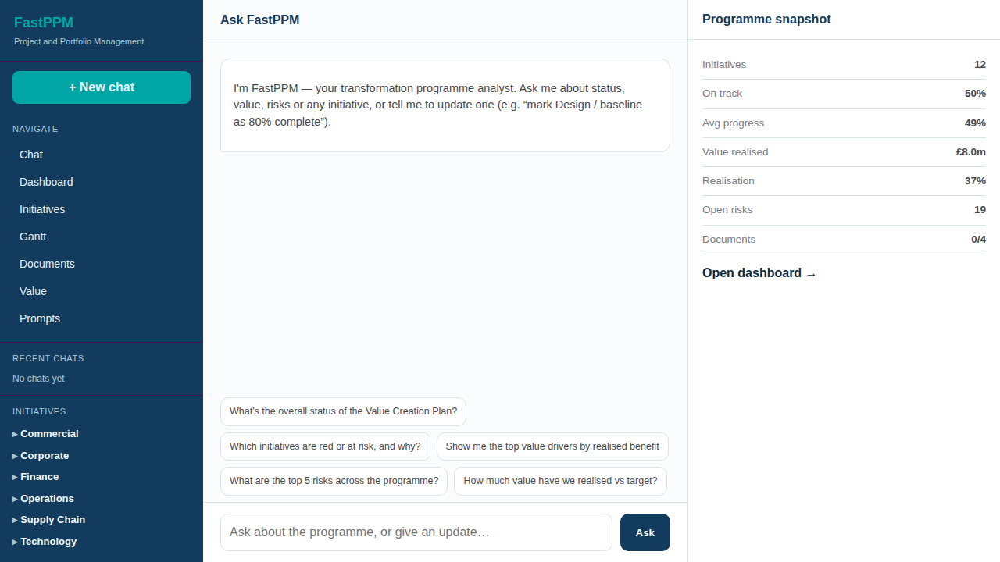
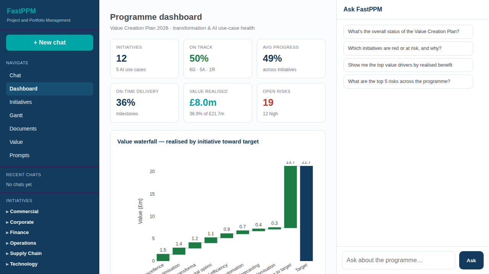
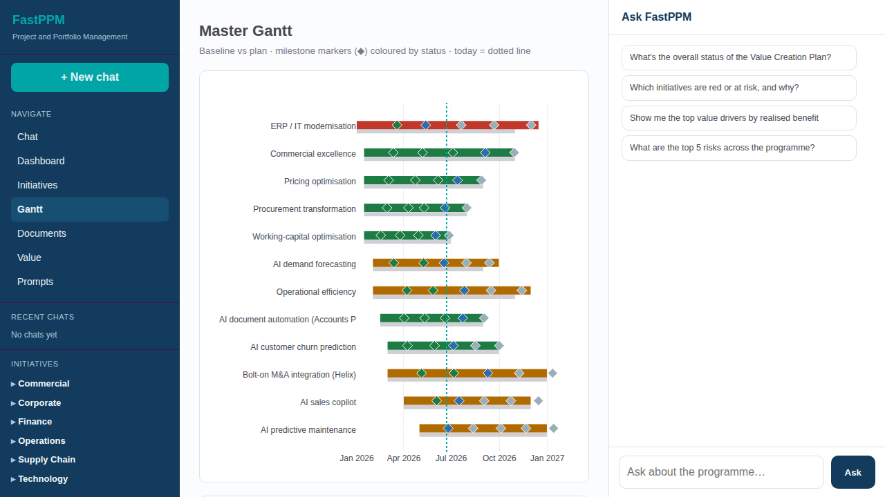
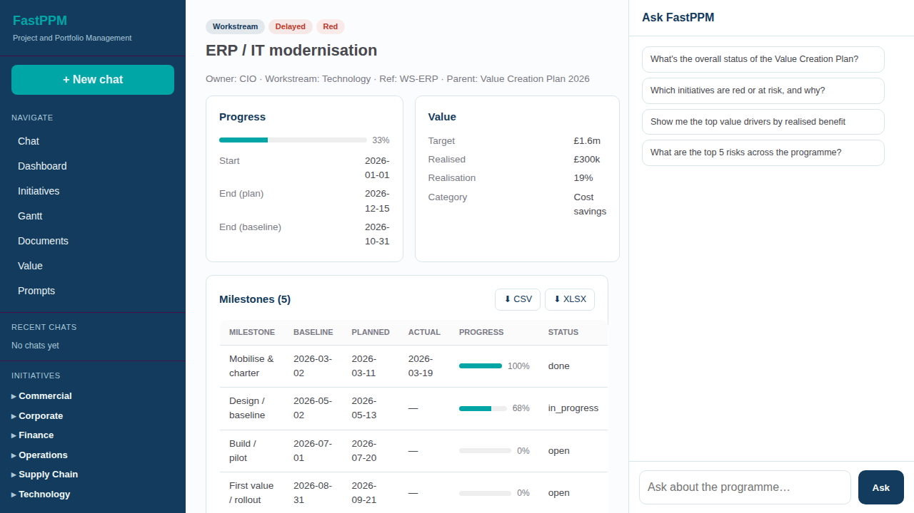

# FastPPM — User Guide

FastPPM is your single source of truth for the **Value Creation Plan**: every
transformation initiative and internal AI use case, with a chat analyst that
knows all your data. This guide walks through the main things you'll do.

## Product tour

---

## Your typical journey

From a messy status report to a board-ready story — here's the everyday happy
path through FastPPM:

1. **Sign in** → you land on the chat analyst that already knows every
   initiative, milestone, risk and value driver.
2. **Ingest** → drag a status report, tracker or deck (PDF / XLSX / PPTX / DOCX)
   into **Documents**; the AI extracts the structure.
3. **Review & merge** → check the **before → after**, then **merge into the
   master repository** in one click.
4. **Track** → your initiative is now live in the **registry, Gantt and
   dashboard** — one source of truth.
5. **Ask & update** → ask the copilot for status, risk and value, and give
   updates in plain English (each recorded in the audit trail).
6. **Report** → generate a board-ready report from a template, edit it
   block-by-block, and export to **PDF / DOCX / PPTX**.

The rest of this guide covers each step in detail.

---

## The layout

FastPPM has three panes:

- **Left** — navigation, recent chats, and the initiative tree (grouped by
  workstream). Click any initiative to open it.
- **Centre** — the chat analyst (home), or whichever page you've opened.
- **Right** — the copilot rail ("Ask FastPPM") and a programme snapshot.

---

## 1. Ask FastPPM (chat-first)

The home screen is a chat analyst. Ask in plain English:

- *"What's the overall status of the Value Creation Plan?"*
- *"Which initiatives are red or at risk, and why?"*
- *"Show me the top value drivers by realised benefit."*
- *"What are the top 5 risks across the programme?"*
- *"How much value have we realised vs target?"*

You can also **give updates** in natural language — the analyst applies them and
records an audit entry:

- *"Mark Design / baseline as 80% complete."*
- *"Set ERP modernisation to at risk."*

> Tip: progress updates ("80% complete") target a **milestone**; status updates
> ("at risk", "delayed", "on track") target an **initiative**. Name the item
> clearly so the right one is matched.

The same copilot is available on every page from the right-hand rail.

### Charts on demand

Ask a **quantitative** question and FastPPM answers visually:

- *"What's value realised by category?"* · *"How many initiatives are red?"* ·
  *"Show progress by workstream."* · *"Show the value trend over time."*
- You get a **table of the real numbers** first, then a row of **chart chips**
  — **Bar**, **Pie** or **Line** — with the best fit highlighted.
- Click a chip and the **interactive chart draws inline**, right in the chat;
  switch chart type any time. Time series default to a **line**, comparisons to
  a **bar**, and parts-of-whole to a **pie**.

The numbers always come from the live programme data — never invented — so the
table and chart match the dashboard.

---

## 2. Ingest documents (the flagship)

Turn messy status reports, trackers and decks into structured initiatives.

1. Go to **Documents**.
2. **Drag & drop** (or choose) one or more **PDF / XLSX / PPTX / DOCX** files and
   click **Upload & extract**.
3. FastPPM parses each file and extracts **milestones, risks and value
   drivers**, normalising different column names and date formats, and flags any
   **inconsistencies** (e.g. "100% but not complete", late delivery, missing
   owner).
4. Click **Review** to see the **before → after**: your original document on the
   left (the messy source), and the clean, structured result FastPPM extracted
   on the right — milestones, risks and value drivers, with any inconsistencies
   flagged. Each extracted table has **⬇ CSV** and **⬇ XLSX** download buttons.
5. Click **Merge into master repository** — the initiative appears in the
   registry, Gantt and dashboard, and becomes searchable from the chat.

> Any milestone or risk table — on a reviewed document or an initiative — can be
> exported to **CSV** or **Excel (XLSX)** from the buttons in its header.

### Build a final report

The **Documents** tab also has a **Report builder** (its right pane is a live
document preview):

1. **① Upload a report template** (PDF / DOCX / MD / TXT) — its sections guide
   the output.
2. **② Generate report** — FastPPM writes a board-ready report that merges the
   programme data (status, value, initiatives, risks) into your template.
3. **Edit** the report block-by-block in a **WYSIWYG editor** (hover a block to
   edit, reorder, add or delete) — changes show live in the preview pane.
4. **Export** to **PDF**, **DOCX** or **PPTX**.

A document moves through `Uploaded → Extracted → Merged`. Merged documents stay
linked to the initiative they created (see the initiative's header).

---

## 3. Track initiatives

- **Initiatives** lists every initiative & AI use case, filterable by type and
  status, with progress, value (realised / target) and milestone counts.
- Open an initiative for its **milestones** (baseline vs planned vs actual),
  **risk register**, **value**, the **source document** it was ingested from, and
  a full **audit trail**.

---

## 4. The master Gantt

**Gantt** shows every scheduled initiative on one timeline:

- **Bars** are coloured by RAG (green / amber / red); the thin grey bar above is
  the **baseline**, so slippage is visible at a glance.
- **Diamonds (◆)** are milestones, coloured by status (green = done, blue = in
  progress, grey = open).
- The **dotted teal line** is today.

Below the Gantt you'll find a **Kanban** (initiatives by status) and a
**dependency map** (milestone → milestone).

---

## 5. Dashboard & value

- **Dashboard** — programme health at a glance: initiatives, on-track %, average
  progress, on-time delivery, value realised vs target, open risks, the **value
  waterfall** (realised by initiative toward target), RAG donut, value by
  category, and recent activity.
- **Value** — value realised vs target overall, **by category** (EBITDA, cost
  savings, revenue, synergy) and **by period**, plus a per-initiative table.

---

## 6. Prompt Manager

**Prompts** lets you tune what the AI extracts from documents — no markdown or
code needed:

- Edit the extraction prompt in a **WYSIWYG editor** (formatting toolbar; use the
  code button for the JSON schema).
- Every **Save** creates a new **active version**; the full **version history** is
  kept, and you can **re-activate** any earlier version with one click.
- The document extractor always uses the *active* version, so changes take effect
  on the next upload.

---

## 7. Signing in

Sign in with **Google** ("Continue with Google") or with your **email and
password**. Access is limited to authorised accounts.

---

## Need the technical details?

See **Help → Technical Architecture** for the data model, the ingestion pipeline,
the AI layer, environment variables and deployment.
